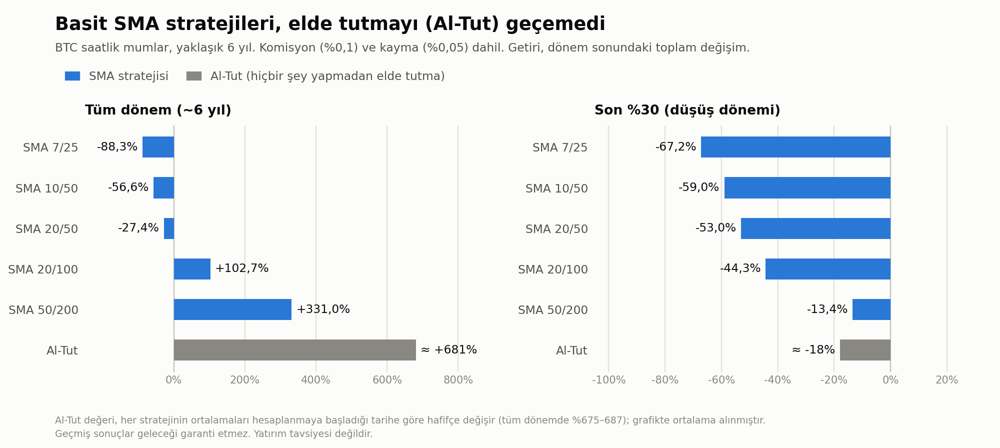

# Binance TR Trend Botu (SMA kesişim) + Backtest

Binance TR için yazılmış, **risk limitli** ve **Telegram bildirimli** bir kripto al-sat botu. Proje, bir stratejiyi gerçek paraya sokmadan önce geçmiş veriyle test etme (backtest) ve sonucu dürüstçe yorumlama üzerine kurulu.

> **Uyarı:** Bu proje eğitim ve portföy amaçlıdır, yatırım tavsiyesi değildir. Kripto piyasasında işlem yapmak ciddi kayıp riski taşır. Bot geçmişte basit al-tut'u geçemedi (aşağıya bakın). Kullanırsan kaybetmeyi göze alabileceğin bir tutarla, kendi sorumluluğunda kullan.

## Özellikler

- **Backtest araçları:** Farklı SMA kombinasyonlarını, zaman dilimlerini (1s / 4s / günlük), trend filtresini ve stop-loss'u komisyon ve kayma dahil test eder. Verinin son %30'unu "görülmemiş dönem" olarak ayrı raporlar.
- **Canlı bot (`canli_bot.py`):** Binance TR'nin resmi REST API'sine (`/open/v1/...`, HMAC-SHA256 imza) bağlanır.
- **Sanal (paper) mod:** Varsayılan moddur, gerçek emir göndermez, API anahtarı gerektirmez.
- **Risk yönetimi:** %5 stop-loss, sermayenin %25'i kaybedilince kendini kapatma, işlem başına tavan tutar, art arda hatada durma.
- **Telegram bildirimi:** Alım, satım, hata ve günlük özet mesajları.
- **Etkileşimli kurulum:** Token ve mod seçimi çalışırken sorulur, koda gizli bilgi yazılmaz.

## Strateji

4 saatlik mumlarda **SMA 50 / SMA 200**: kısa ortalama uzun ortalamanın üstündeyken pozisyonda kalır, altına inince satar. Sinyal yalnızca **kapanmış** mumlardan hesaplanır (geleceği görme hatası yok).

## Backtest sonuçları (dürüst özet)
   
Ayrıntılar: [`docs/backtest_sonuclari.md`](docs/backtest_sonuclari.md)

- Yaklaşık **6 yıllık** BTC saatlik verisinde basit SMA kesişimleri, komisyon ve kayma sonrası **al-tut'u geçemedi**. En iyi ayar (SMA 50/200) %331 getirirken al-tut yaklaşık %681 yaptı, en büyük düşüş %58,6 idi.
- Hızlı ayarlar (SMA 7/25 gibi) büyük zarar yazdı (-%88).
- Son %30'luk (düşüş) dönemde tüm ayarlar zararda kaldı.
- 2 yıllık kısa testte "aday" görünen stratejilerin bir kısmı, uzun veride tutarlı çıkmadı. Bu, **kısa veriyle aşırı uydurmanın (overfitting)** tipik bir örneği. Projenin asıl kazanımı bu sonuca gerçek para kaybetmeden ulaşmak.

## Kurulum

```bash
git clone https://github.com/ayhanturan167/binance-tr-trend-bot.git
cd binance-tr-trend-bot
pip install -r requirements.txt
```

### Backtest

```bash
python backtest.py      # SMA kombinasyonları, tüm dönem + son %30
python backtest2.py     # 1s/4s/günlük, trend filtresi, stop-loss karşılaştırması
```

İlk çalıştırmada 6 yıllık veri indirilir ve `btc_1h_6yil.csv` olarak kaydedilir (`.gitignore`'da, depoya girmez). API anahtarı gerekmez.

### Canlı bot

```bash
python canli_bot.py
```

Bot sırayla Telegram token'ını, chat id'yi ve modu sorar. Varsayılan **sanal moddur**. Gerçek mod için `GERCEK` yazıp Binance TR API anahtarlarını girersin (kaydedilmez).

**API anahtarı ayarları (Binance TR):** Okuma + Alım Satım açık, **Çekme izni kapalı**, IP kısıtlaması açık.

## Proje yapısı

```
.
├── canli_bot.py          # Canlı/sanal bot (Binance TR API, Telegram, risk limitleri)
├── backtest.py           # SMA kesişim backtest + veri indirme
├── backtest2.py          # Zaman dilimi, trend filtresi, stop-loss karşılaştırması
├── telegram_test.py      # Telegram bağlantı testi
├── docs/
│   └── backtest_sonuclari.md
├── requirements.txt
├── .gitignore
└── LICENSE
```

## Güvenlik

- `bot_ayarlar.json` (Telegram token) ve `bot_durum_*.json` dosyaları `.gitignore`'dadır. **Bu dosyaları asla depoya ekleme.**
- API anahtarlarını koda yazma, sohbete/ekran görüntüsüne koyma.
- Bir anahtar yanlışlıkla paylaşıldıysa Binance TR / BotFather üzerinden hemen iptal edip yenisini oluştur.

## Bilinen sınırlamalar

- Bot bilgisayarın açık ve internete bağlı olmasına bağlıdır. Kapanırsa stop-loss çalışmaz.
- Stop-loss, borsada tanımlı bir emir değil, botun 5 dakikada bir fiyata bakıp verdiği piyasa emridir. Ani düşüşte daha kötü fiyattan gerçekleşebilir.
- Binance TR API'sinin gerçek emir yanıtları sınırlı test edilmiştir.
- Sadece BTC/TRY, tek pozisyon, tek strateji.

## Geliştirme fikirleri

- Telegram'dan komut alma (`/durum`, `/sat`, `/dur`)
- Sunucuda (VPS) 7/24 çalıştırma
- Walk-forward test ve çoklu varlık backtest'i
- RSI / volatilite filtreleri, pozisyon büyüklüğü hesaplama

## Lisans

MIT, ayrıntı için `LICENSE` dosyasına bak.
